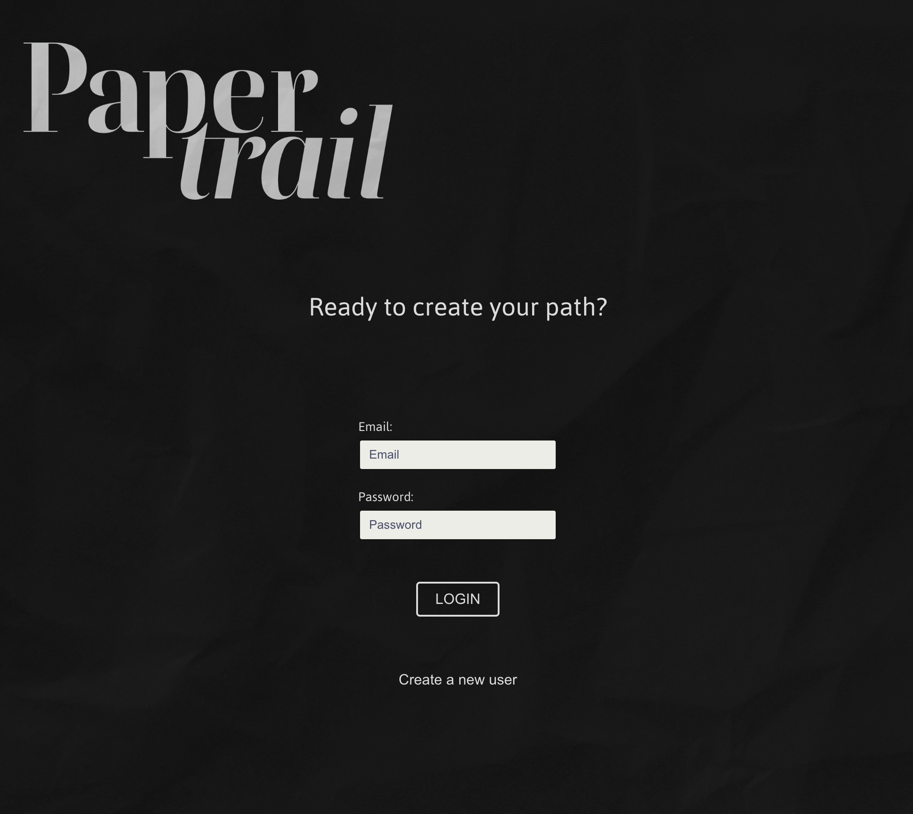
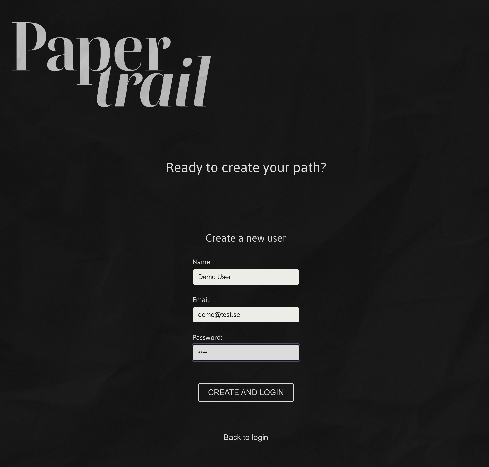
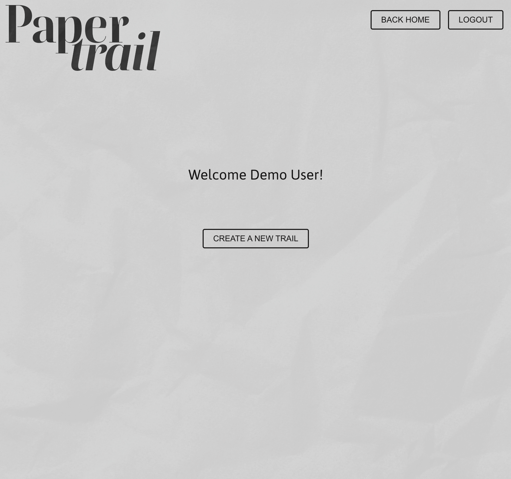
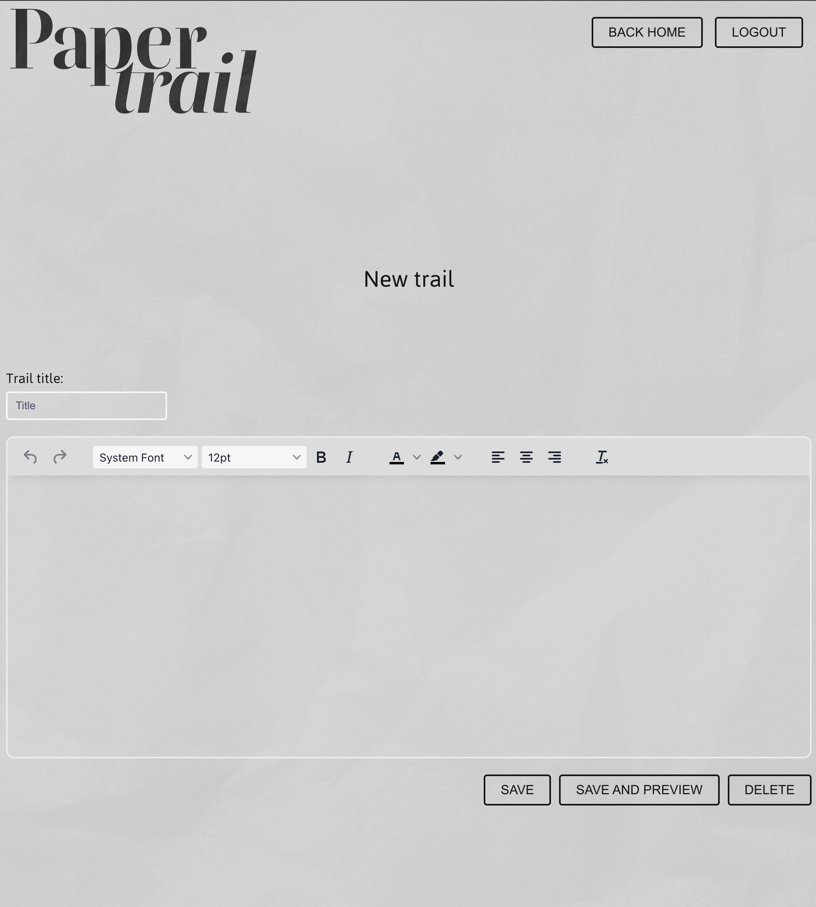
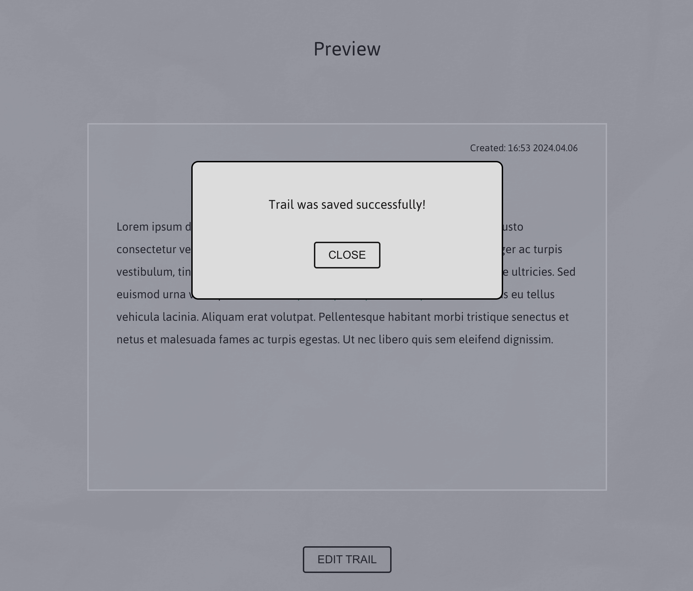
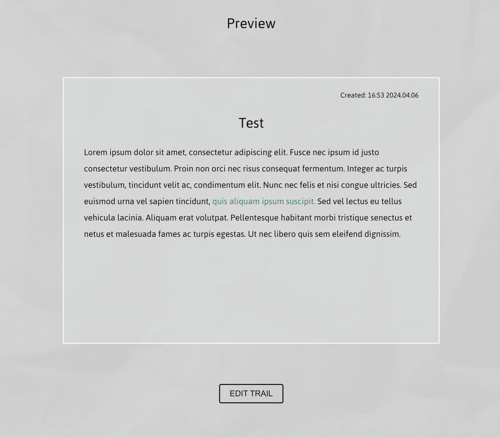
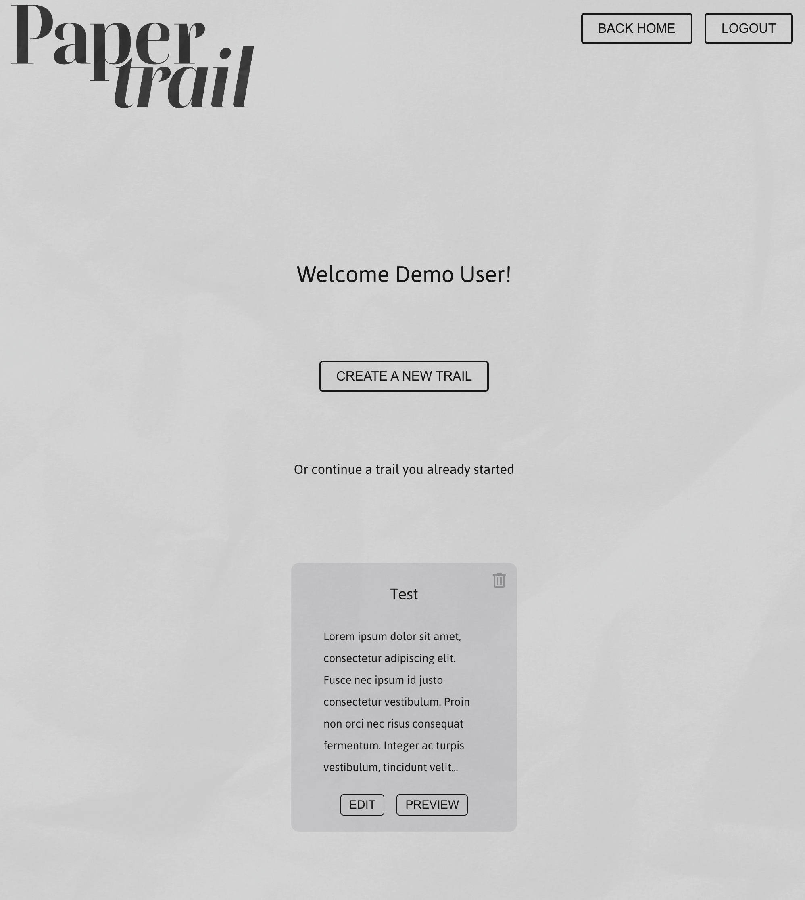
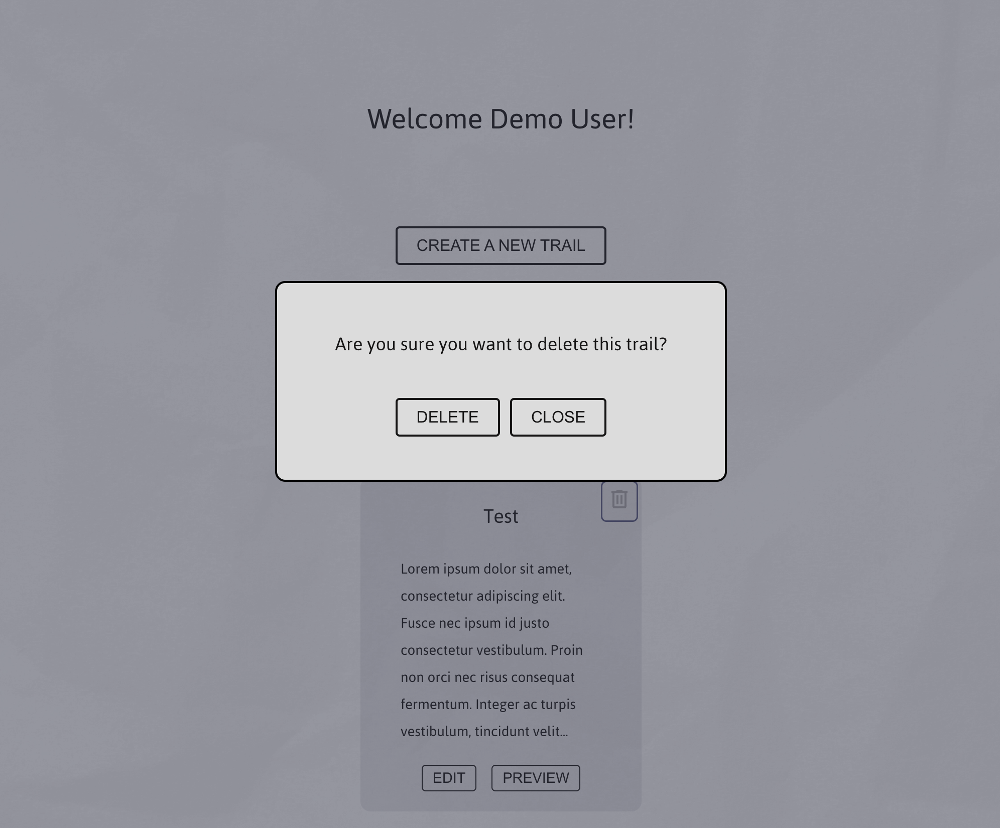

# PaperTrail

PaperTrail is a document management system. With a minimalistic interface, users can store, format, and create documents.

## Assignment

PaperTrail is a project aimed at developing a comprehensive document management system with a relational database backend. The focus is on providing users with features for creating, editing, and managing digital documents seamlessly. Key requirements include user authentication, document creation and storage in a MySQL database, and implementing a headless architecture with separate frontend and API components. Additionally, the project emphasizes CRUD operations and a WYSIWYG editor for enhanced document formatting and customization.

## Built with

#### Front end:

      

#### Back end:

 

## How to run

Front end is built with with and starts with `npm i` and then `npm run dev`.  
Back end is started with `npm i` and then `nodemon start`. It also has an examples.env and needs a MySQL-database named "papertrail" to run.

## Screenshots

| Desktop Screeenshots                           |
| ---------------------------------------------- |
|            |
|           |
|  |
|              |
|            |
|            |
|              |
|        |

---

## Lessons Learned

This assignment provided invaluable insights into understanding the user flow within a website, encompassing various interactions and navigation paths. It served as a valuable lesson in identifying opportunities for code reuse and recognizing instances of code duplication. Through this experience, I gained a deeper understanding of optimizing user experiences and maintaining code efficiency.

## Author

[@olandstorm](https://github.com/olandstorm)
